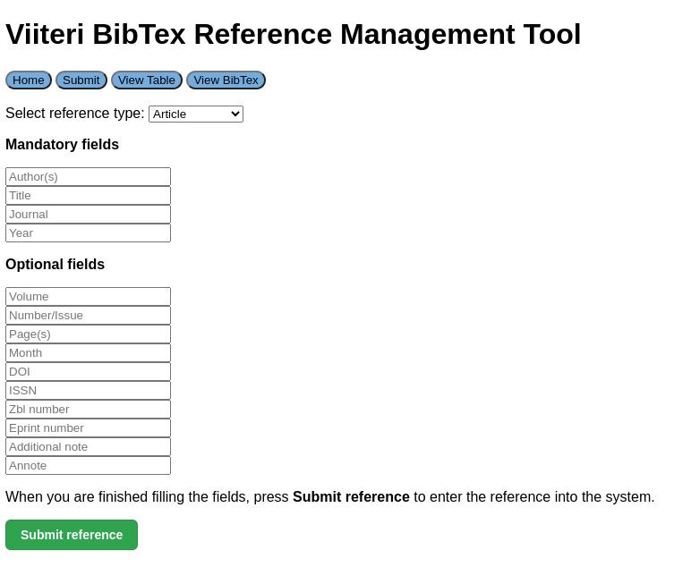

# <p align="center"></p>

<p align="center">
    <a href="https://github.com/3nd3r1/ohtu-miniprojekti/actions/workflows/main.yml" alt="Continuous Integration">
        
    </a>
    <a href="https://codecov.io/gh/3nd3r1/ohtu-miniprojekti" alt="Codecov">
        
    </a>
    <a href="https://github.com/3nd3r1/ohtu-miniprojekti/blob/main/LICENSE" alt="License">
        
    </a>
    <a href="https://github.com/3nd3r1/ohtu-miniprojekti/releases/latest" alt="Release">
        
    </a>
    
</p>

<p align="center">
Viiteri on käyttäjäystävällinen BibTeX-viitehallintatyökalu akateemisten lähteiden hallintaan ja niiden yhdistämiseen LaTeX-dokumentteihin, tukien monia viitetyyppejä, kuten artikkeleita ja kirjoja.
</p>
<p align="center">
    <a href="https://ohjelmistotuotanto-hy.github.io/speksi/">Speksi</a>
    ·
    <a href="https://viiteri-page.host.ender.fi/">Live Demo</a>
</p>

## Kuvakaappaus



## Käyttöohje

1. **Varmista, että Poetry on Asennettu:**
   Jos sinulla ei ole Poetrya asennettuna, asenna se Poetryn virallisilta verkkosivuilta: [Poetry Installation](https://python-poetry.org/docs/).

2. **Kloonaa Viiteri Repositorio:**
    - Avaa komentokehote tai pääte ja suorita seuraava komento:
    ```
    git clone https://github.com/your-username/viiteri.git
    ```
    - Siirry luotuun hakemistoon
    ```
    cd viiteri
    ```
3. **Asenna Riippuvuudet Poetryn Avulla**
    - Asenna riippuvuudet suorittamalla komento:
    ```
    poetry install
    ```
4. **Alusta tietokanta**
    - Varmista, että PostgreSQL on asennettu. Jos ei asenna se verkkosivulta: [PostgreSQL Downloads](https://www.postgresql.org/download/)
    - Alusta tietokanta suorittamalla komento:
    ```
    poetry run invoke init-db
    ```
5. **Käynnistä Sovellus Debug-Tilassa**
    - Käynnistä Viiteri debug-tilassa suorittamalla komento:
    ```
    poetry run invoke debug
    ```
6. **Avaa nettisivu**
    - Kun sovellus on käynnistetty, voit käyttää sitä selaimessasi osoitteessa:
    ```
    http://localhost:5001
    ```

## Kehitys

-   [Definition of Done](./docs/definition_of_done.md)
-   [Retrospektiivit](./RETRO.md)
-   [Loppuraportti](./REPORT.md)
-   [Product Backlog](https://github.com/users/3nd3r1/projects/2/views/1)
-   [Sprint 1 Task Board](https://github.com/users/3nd3r1/projects/1/views/1)
-   [Sprint 2 Task Board](https://github.com/users/3nd3r1/projects/3/views/1)
-   [Sprint 3 Task Board](https://github.com/users/3nd3r1/projects/4/views/1)
-   [Sprint 4 Task Board](https://github.com/users/3nd3r1/projects/5/views/1)
