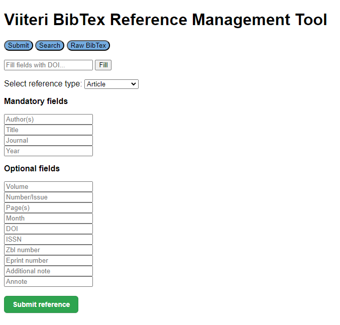

# <p align="center"></p>

<p align="center">
    <a href="https://github.com/3nd3r1/ohtu-miniprojekti/actions/workflows/main.yml" alt="Continuous Integration">
        
    </a>
    <a href="https://codecov.io/github/3nd3r1/viiteri" > 
         
    </a>
    <a href="https://github.com/3nd3r1/ohtu-miniprojekti/blob/main/LICENSE" alt="License">
        
    </a>
    <a href="https://github.com/3nd3r1/ohtu-miniprojekti/releases/latest" alt="Release">
        
    </a>
    
</p>

<p align="center">
Viiteri is a user-friendly BibTeX reference management tool designed for managing academic sources and integrating them into LaTeX documents. It supports various reference types, including articles and books.
</p>
<p align="center">
    <a href="https://ohjelmistotuotanto-hy.github.io/speksi/">Specs</a>
    ·
    <a href="https://viiteri-page.host.ender.fi/">Live Demo</a>
</p>

## Preview



## Running locally

1. **Ensure Poetry is Installed:**
    - If you don't have Poetry installed, install it from the official Poetry website: [Poetry Installation](https://python-poetry.org/docs/).

2. **Clone the Viiteri Repository:**
    - Open a terminal or command prompt and run the following command:
        ```
        git clone https://github.com/your-username/viiteri.git
        ```
    - Navigate to the created directory
        ```
        cd viiteri
        ```

3. **Install Dependencies Using Poetry**
    - Install dependencies by running the command:
         ```
         poetry install
         ```

4. **Initialize the Database**
    - Ensure PostgreSQL is installed. If not, install it from the website: [PostgreSQL Downloads](https://www.postgresql.org/download/)
    - Initialize the database by running the command:
        ```
        poetry run invoke init-db
        ```

5. **Run the Application in Debug Mode**
    - Start Viiteri in debug mode by running the command:
        ```
        poetry run invoke debug
        ```

6. **Open the Website**
    - Once the application is running, access it in your browser at:
         ```
         http://localhost:5001
         ```

## Development (In Finnish)

- [Definition of Done](./docs/definition_of_done.md)
- [Retrospektiivit](./RETRO.md)
- [Product Backlog](https://github.com/users/3nd3r1/projects/2/views/1)
- [Sprint 1 Task Board](https://github.com/users/3nd3r1/projects/1/views/1)
- [Sprint 2 Task Board](https://github.com/users/3nd3r1/projects/3/views/1)
- [Sprint 3 Task Board](https://github.com/users/3nd3r1/projects/4/views/1)
- [Sprint 4 Task Board](https://github.com/users/3nd3r1/projects/5/views/1)
