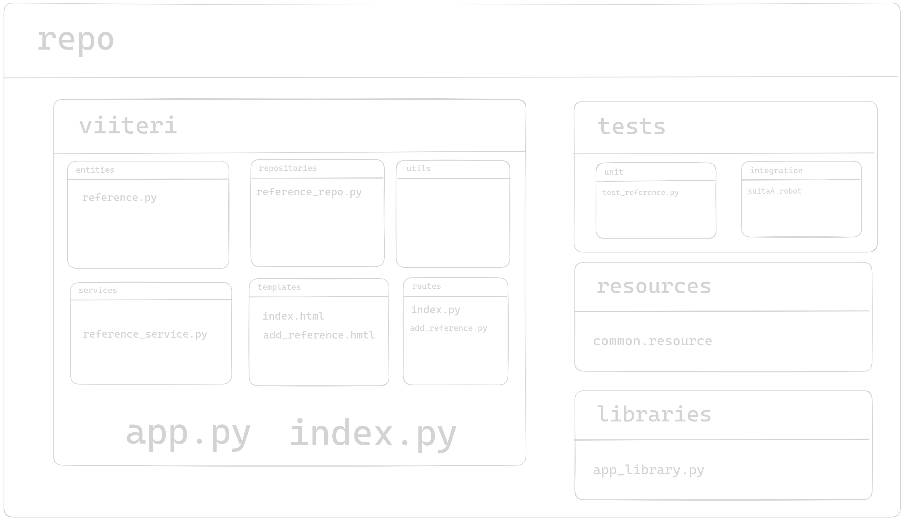

# Viljamin Vaatismusmäärittely

# Yleistä

-   Nimi: Viiteri
-   Koodi: Python
-   Package manager: poetry
-   Dokumentaatio: Suomeksi
-   Koodin kieli: englanniksi
-   Checkstyle: pylint

## Rakenne

Inspiraatio: [github.com/tehtavat/viikko3/web-login](https://github.com/ohjelmistotuotanto-hy/tehtavat/blob/main/viikko3/web-login)

### Huomioita

-   Kaikki viittaukset muodossa:

    `import Reference from viiteri.entities.reference`

-   Kaikki nimet snake_case

## Testaus

-   Yksikkötestaus: unittest
-   Integraatiotestaus: robot
